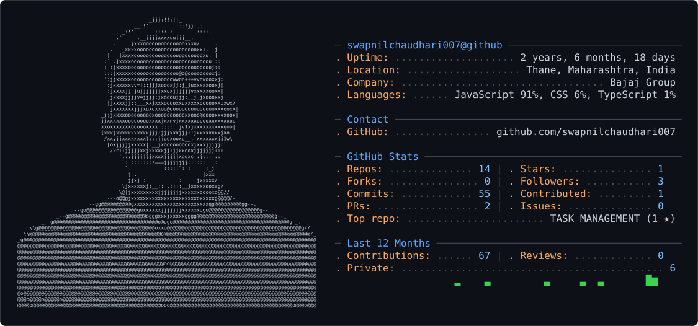

<a href="https://www.linkedin.com/in/swapnil-chaudhari-533a25105/">
  <picture>
    <source media="(prefers-color-scheme: dark)" srcset="assets/hero-dark.svg" />
    <source media="(prefers-color-scheme: light)" srcset="assets/hero-light.svg" />
    
  </picture>
</a>

<picture>
<source media="(prefers-color-scheme: dark)" srcset="dark_mode.svg" />
  <source media="(prefers-color-scheme: light)" srcset="light_mode.svg" />
  
</picture>

---

### 👨‍💻 About Me

Software Engineer from **Thane, India** with a strong backend foundation in **C#, ASP.NET, C/C++ and SQL**, now shipping **AI and cloud-native products** — from voice assistants on AWS to computer-vision safety systems and mixed-reality apps.

- 🔭 Building production-style hackathon projects across **AI, AWS, mobile and XR**
- 🧠 Exploring **LLMs, MCP servers, computer vision** and serverless architectures
- ⚙️ Day-to-day: APIs, databases, Linux, and clean, maintainable backend code
- 🤝 Open to **backend / full-stack / AI engineering** opportunities

---

### 🚀 Featured Projects

| Project | What it does | Stack |
|---|---|---|
| 🩺 **[CareCircle](https://github.com/swapnilchaudhari007/carecircle-mcp)** | Alexa+ MCP server for elder medication care — voice dose logging, double-dose guard, family alerts, multilingual digests | TypeScript · AWS Bedrock · Lambda · DynamoDB · SNS |
| 🦺 **[SafetyEye](https://github.com/swapnilchaudhari007/safetyeye)** | AI PPE & hazard monitor for worksites — helmet/vest detection, restricted zones, fall detection, multilingual alerts | Python · YOLO11 · FastAPI |
| 🥽 **[PinchPlan](https://github.com/swapnilchaudhari007/pinchplan)** | Hands-first mixed-reality focus desk for Meta Quest | WebXR · JavaScript |
| 🎮 **[QuestLog](https://github.com/swapnilchaudhari007/questlog)** | Your gaming bucket list, gamified — with in-app subscriptions | TypeScript · Expo · RevenueCat |
| 🏘️ **[SocietyMitra](https://github.com/swapnilchaudhari007/societymitra)** | AI co-secretary for housing societies — an AI agent built on NVIDIA Nemotron via Nebius Token Factory | Python · NVIDIA Nemotron · Nebius · Tavily |

---

### 🛠️ Tech Stack

**Languages**

**Backend & Frameworks**

**Frontend & Mobile**

**Databases & Cloud**

**AI & Tools**

---

### 📊 GitHub Activity

<picture>
  <source media="(prefers-color-scheme: dark)" srcset="assets/contrib-3d-dark.svg" />
  <source media="(prefers-color-scheme: light)" srcset="assets/contrib-3d-light.svg" />
  
</picture>

---

💬 **Let's build something together — reach out on [LinkedIn](https://www.linkedin.com/in/swapnil-chaudhari-533a25105/) or [email](mailto:sc29823@gmail.com).**

