<a href="https://www.linkedin.com/in/swapnil-chaudhari-533a25105/">
<picture>
  <source media="(prefers-color-scheme: dark)" srcset="assets/hero-dark.svg" />
  <source media="(prefers-color-scheme: light)" srcset="assets/hero-light.svg" />
  
</picture>
</a>

<a href="https://www.linkedin.com/in/swapnil-chaudhari-533a25105/"><picture>
  <source media="(prefers-color-scheme: dark)" srcset="assets/btn-linkedin-dark.svg" />
  <source media="(prefers-color-scheme: light)" srcset="assets/btn-linkedin-light.svg" />
  
</picture></a>
<a href="mailto:sc29823@gmail.com"><picture>
  <source media="(prefers-color-scheme: dark)" srcset="assets/btn-email-dark.svg" />
  <source media="(prefers-color-scheme: light)" srcset="assets/btn-email-light.svg" />
  
</picture></a>

 

<picture>
  <source media="(prefers-color-scheme: dark)" srcset="assets/about-dark.svg" />
  <source media="(prefers-color-scheme: light)" srcset="assets/about-light.svg" />
  
</picture>

  

<picture>
  <source media="(prefers-color-scheme: dark)" srcset="assets/projects-header-dark.svg" />
  <source media="(prefers-color-scheme: light)" srcset="assets/projects-header-light.svg" />
  
</picture>

<a href="https://github.com/swapnilchaudhari007/carecircle-mcp"><picture>
  <source media="(prefers-color-scheme: dark)" srcset="assets/project-carecircle-dark.svg" />
  <source media="(prefers-color-scheme: light)" srcset="assets/project-carecircle-light.svg" />
  
</picture></a>
<a href="https://github.com/swapnilchaudhari007/safetyeye"><picture>
  <source media="(prefers-color-scheme: dark)" srcset="assets/project-safetyeye-dark.svg" />
  <source media="(prefers-color-scheme: light)" srcset="assets/project-safetyeye-light.svg" />
  
</picture></a>
<a href="https://github.com/swapnilchaudhari007/pinchplan"><picture>
  <source media="(prefers-color-scheme: dark)" srcset="assets/project-pinchplan-dark.svg" />
  <source media="(prefers-color-scheme: light)" srcset="assets/project-pinchplan-light.svg" />
  
</picture></a>
<a href="https://github.com/swapnilchaudhari007/questlog"><picture>
  <source media="(prefers-color-scheme: dark)" srcset="assets/project-questlog-dark.svg" />
  <source media="(prefers-color-scheme: light)" srcset="assets/project-questlog-light.svg" />
  
</picture></a>
<a href="https://github.com/swapnilchaudhari007/societymitra"><picture>
  <source media="(prefers-color-scheme: dark)" srcset="assets/project-societymitra-dark.svg" />
  <source media="(prefers-color-scheme: light)" srcset="assets/project-societymitra-light.svg" />
  
</picture></a>

 

<picture>
  <source media="(prefers-color-scheme: dark)" srcset="assets/stack-dark.svg" />
  <source media="(prefers-color-scheme: light)" srcset="assets/stack-light.svg" />
  
</picture>

  

<picture>
  <source media="(prefers-color-scheme: dark)" srcset="assets/contrib-3d-dark.svg" />
  <source media="(prefers-color-scheme: light)" srcset="assets/contrib-3d-light.svg" />
  
</picture>

  

<picture>
<source media="(prefers-color-scheme: dark)" srcset="dark_mode.svg" />
  <source media="(prefers-color-scheme: light)" srcset="light_mode.svg" />
  
</picture>

 

<a href="https://www.linkedin.com/in/swapnil-chaudhari-533a25105/">
<picture>
  <source media="(prefers-color-scheme: dark)" srcset="assets/cta-dark.svg" />
  <source media="(prefers-color-scheme: light)" srcset="assets/cta-light.svg" />
  
</picture>
</a>

<a href="https://www.linkedin.com/in/swapnil-chaudhari-533a25105/"><picture>
  <source media="(prefers-color-scheme: dark)" srcset="assets/btn-linkedin-dark.svg" />
  <source media="(prefers-color-scheme: light)" srcset="assets/btn-linkedin-light.svg" />
  
</picture></a>
<a href="mailto:sc29823@gmail.com"><picture>
  <source media="(prefers-color-scheme: dark)" srcset="assets/btn-email-dark.svg" />
  <source media="(prefers-color-scheme: light)" srcset="assets/btn-email-light.svg" />
  
</picture></a>

